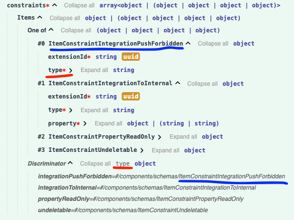

[Prev: Home](/){: .btn }

# Schema details

## General conventions

1. All the endpoints always accept and return JSON (including error responses). The only exception is the attachment endpoints which work with binary files.
2. Most of the retrieve/search endpoints return resources with additional embedded data, injected into the resource as `_embedded` field. There is no way to control what data is returned, i.e. they always return the full data. However, some endpoints (like item-search) have an alternative "partial" version, which allows requesting only specific fields. It's recommented to use the "partial" endpoints if possible, to reduce the amount of data transferred and improve performance.
3. At the moment we have multiple API endpoints which share the same schema-type for both read and write operations in most of the resources.
  However, server reserves the right to ignore some read-only fields during write-operations - e.g. fields `id`, `createdAt`, `updatedAt`, etc. are ignored when updating a resource.
  We will gradually improve it in the future by defining separated schemas for read and write operations.
4. HTTP response code conventions:
   - 404 is returned when trying to access a non-existing endpoint (invalid path)
   - 400 is returned when trying to access a non-existing resource (valid path, but invalid resource ID)
5. each response includes an `X-Request-Id` header, which can be included as an additional info when reporting bugs to airfocus team -
   this will help us with issue investigation and debugging.

## Error responses

All error responses contain a JSON payload with the following fields:
- `code` - a machine-readable error code, e.g. `invalid_request`, `not_found`, `rate_limit_exceeded`, etc.
- `message` - a human-readable error message explaining the problem
- `data` - an additional optional machine-readable JSON data about the error

For the sake of data protection, we do not return detailed messages for most of the internal server errors (HTTP 500).

## Rich-text formatting

Resources which include `RichText` (e.g. `Item` with its `description` field) can be optionally handled by the server in Markdown format:
- to send a request payload which includes Markdown-formatted `RichText`, change `Content-Type` header to `application/vnd.airfocus.markdown+json`
- to receive a response payload which includes `RichText` formatted as Markdown, change `Accept` header to `application/vnd.airfocus.markdown+json`

{: .note }
> The `application/vnd.airfocus.markdown+json` media-type can be only used with endpoints which support rich-text formatting.
> For all the other endpoints using this media-type will result in `HTTP 406 Not Acceptable` response.

The Markdown response returned by using the `application/vnd.airfocus.markdown+json` has the following structure:
```json
{
  "markdown": "Markdown text here. This is **bold**.",
  "richText": true
}
```

## Enums with discriminator field

Swagger UI can be not very intuitive when it comes to displaying enums with discriminator fields.<br>
When you explore the schema, you may see some data-types described as `One of` followed by a list of possible types, and an additional `Discriminator` field.<br>
Here is how to understand it (see the example screenshot below):
- all objects in the list share one common field, called the discriminator field
- to know which of the fields is the discriminator field, look for the `Discriminator` section in the schema, which includes the name of this field in the first row (in this case it's `type`)
- therefore, each object in the list must have this field defined with a unique fixed value, which corresponds to this object
- then find the name of the specific object (for example `ItemConstraintIntegrationPushForbidden`), and then find it on the right side in the `Discriminator` section
- then the value on the left side will be the fixed value for the discriminator field (in this case it's `integrationPushForbidden`)
- therefore, the full JSON value would look like this:
```json
{
  "extensionId": "...",
  "type": "integrationPushForbidden"
}
```


## Accessing app-fields

Each app installs its own custom fields in the target workspaces. 
For example Priority Ratings App creates a score field in the corresponding workspace, and then each item in this workspace has a value for this field, which contains the priority rating score calculated by this app for this item.
Therefore, in order to access app data for a specific item, you need to know which fields are installed by this app in the target workspace, and then access these fields by their field IDs from the item fields.
The best way to find field-ids is to retireve the target workspace, and then 
- look into `_embedded.fields` data of that workspace and find the required field by it's `typeId`
- or look into `_embedded.apps` data of that workspace and find the required app, and then look into its `settings` JSON for any reference-ids to the fields installed by this app (the property name differs for each app, but usually it's something like `fieldId`, `scoreFieldId`, `targetFieldId`, etc.)

{: .note }
> All apps prevent their own fields from direct editing via `updateItem` endpoint. When trying to update such a field - the app will ignore the change and keep the previous value. Most of the app-fields are read-only, because apps take responsibility of calculating them, however in some cases apps allow modifying their fields by API - in such case the app itself provides dedicated endpoints for this purpose.

<details>
<summary>App Fields overview</summary>
<ul>
    <li><strong>Calculated</strong> means that the app can recalculate this field in background when some input data changes</li>
    <li><strong>Writable</strong> means that the app provides a dedicated endpoint for clients to modify full all partial value of this field</li>
</ul>

<table>
  <thead>
    <tr>
      <th>App Type</th>
      <th>Field Type</th>
      <th>Calculated</th>
      <th>Writable</th>
      <th>Description</th>
    </tr>
  </thead>
  <tbody>
    <tr><td><code>okr</code></td><td><code>okr-checkins</code></td><td>❌</td><td>✅</td><td>checkins history</td></tr>
    <tr><td><code>okr</code></td><td><code>okr-confidence</code></td><td>❌</td><td>✅</td><td>confidence level of objective item</td></tr>
    <tr><td><code>okr</code></td><td><code>okr-key-results</code></td><td>✅</td><td>✅</td><td>key results of objective item</td></tr>
    <tr><td><code>okr</code></td><td><code>okr-time-period</code></td><td>❌</td><td>✅</td><td>time period of objective item</td></tr>
    <tr><td><code>okr</code></td><td><code>okr-progress</code></td><td>✅</td><td>❌</td><td>total progress of objective item</td></tr>
    <tr><td><code>okr</code></td><td><code>okr-key-result-reference</code></td><td>✅</td><td>❌</td><td>reference from a regular items to linked key-results in objective items</td></tr>
    <tr><td><code>voting</code></td><td><code>votes</code></td><td>❌</td><td>✅</td><td>history of votes for the item</td></tr>
    <tr><td><code>voting</code></td><td><code>votingScore</code></td><td>✅</td><td>❌</td><td>calculated voting score for the item</td></tr>
    <tr><td><code>insights</code></td><td><code>insights</code></td><td>✅</td><td>✅</td><td>insight-links between this item and the other side items</td></tr>
    <tr><td><code>prioritization</code></td><td><code>prioritization</code></td><td>✅</td><td>❌</td><td>calculated prioritization score for the item</td></tr>
    <tr><td><code>mirror</code></td><td><code>mirror-target</code></td><td>❌</td><td>❌</td><td>a reference link to the source item</td></tr>
    <tr><td><code>mirror</code></td><td><code>mirror-source</code></td><td>❌</td><td>❌</td><td>a reference link to the target item</td></tr>
    <tr><td><code>forms</code></td><td><code>form-source</code></td><td>❌</td><td>❌</td><td>a reference link to the source item</td></tr>
    <tr><td><code>forms</code></td><td><code>form-target</code></td><td>❌</td><td>❌</td><td>a reference link to the target item</td></tr>
    <tr><td><code>portal</code></td><td><code>portal</code></td><td>❌</td><td>✅</td><td>all portal data of the item (image, name, description, etc.)</td></tr>
    <tr><td><code>portfolio</code></td><td><code>portfolio-source</code></td><td>✅</td><td>❌</td><td>a reference link to the portfolio workspace (if this item belongs there)</td></tr>
    <tr><td><code>health-check-ins</code></td><td><code>health-check-ins-field</code></td><td>❌</td><td>✅</td><td>checkins history</td></tr>
  </tbody>
</table>
</details>

---
[Next: Authentication](/authentication){: .btn }
